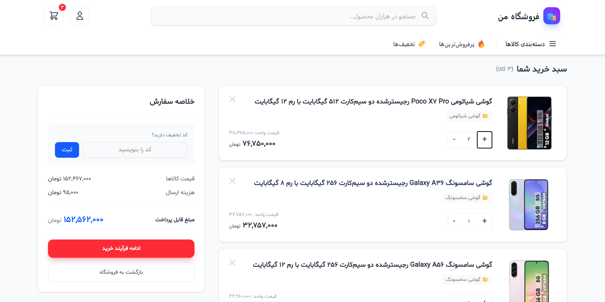
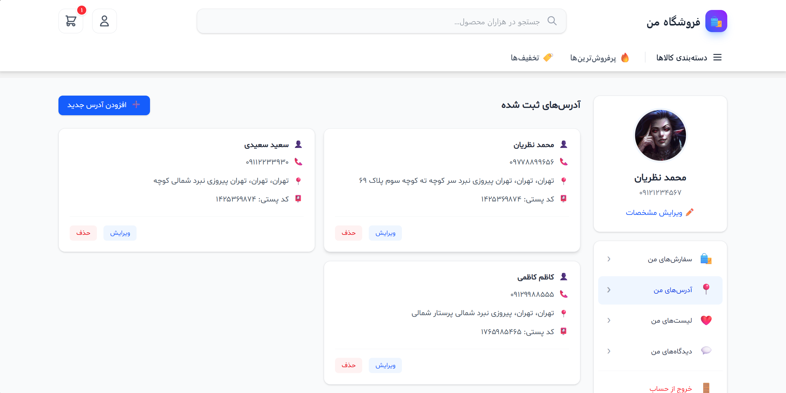
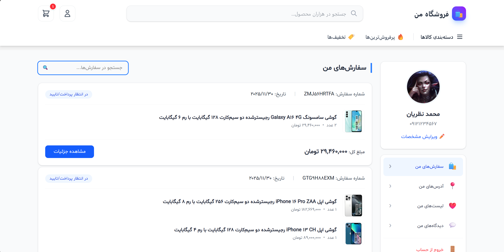
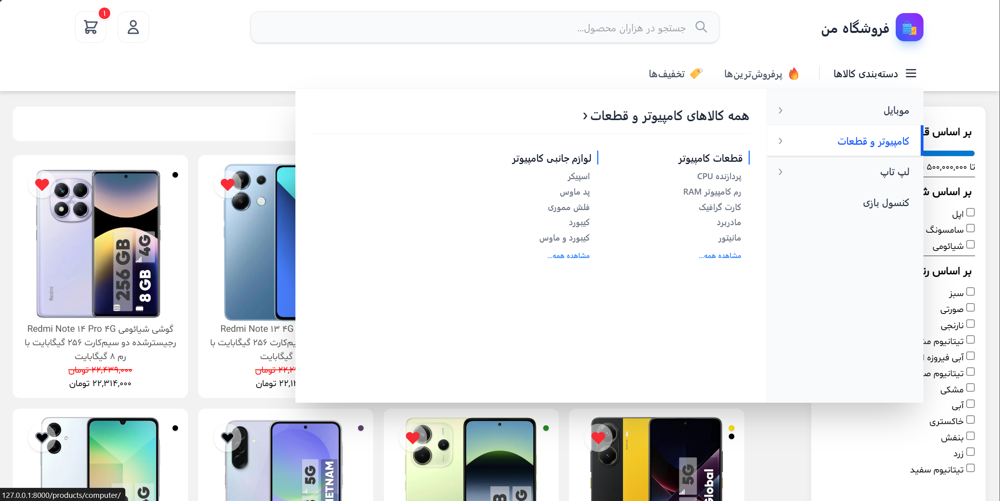
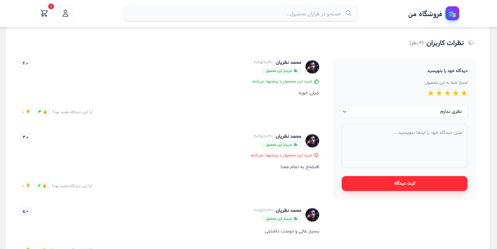

# 🛍️ RedShop - پلتفرم فروشگاه اینترنتی مدرن با جانگو


**RedShop** یک پروژه فروشگاه اینترنتی کامل است که با تمرکز بر **معماری تمیز (Clean Architecture)**، **عملکرد بالا (High Performance)** و **تجربه کاربری روان (UX)** طراحی شده است.

> 🚧 **نکته:** این پروژه در حال توسعه فعال است و هر روز با ویژگی‌های جدید و بازنویسی کدها (Refactoring) بهینه‌تر می‌شود.

---

## 👋 درباره پروژه و توسعه‌دهنده

سلام! من توسعه‌دهنده این پروژه هستم. **RedShop** اولین پروژه حرفه‌ای و بزرگ من در دنیای جانگو است.
هدف من در این پروژه صرفاً ساختن یک سایت که "کار کند" نبوده؛ بلکه تمرکزم روی یادگیری عمیق و پیاده‌سازی استانداردهای مهندسی نرم‌افزار بوده است.

**اهداف اصلی من در این مسیر:**
* رعایت اصول **Clean Code** و **DRY**.
* بهینه‌سازی کوئری‌های دیتابیس (حل مشکل N+1).
* پیاده‌سازی رابط کاربری مدرن و تعاملی (SPA-like) با استفاده از AJAX.
* ساخت داشبورد مدیریت قدرتمند و سفارشی.

---

## ✨ ویژگی‌های کلیدی (Features)

### 🏗️ زیرساخت و بک‌اند (Back-end)
* **احراز هویت سفارشی:** استفاده از شماره موبایل به جای نام کاربری (Custom User Model).
* **دسته‌بندی درختی:** پیاده‌سازی دسته‌بندی‌های تو در تو و نامحدود با `django-mptt`.
* **ویژگی‌های پویا:** قابلیت تعریف ویژگی‌های اختصاصی برای هر دسته‌بندی (مشابه دیجی‌کالا).
* **سبد خرید هوشمند:** سیستم سبد خرید مبتنی بر سشن (Session-based) با قابلیت محاسبه تخفیف.
* **سیستم تخفیف (Coupon):** اعمال کدهای تخفیف با اعتبارسنجی دقیق زمان و سقف استفاده.
* **درگاه پرداخت:** اتصال کامل به درگاه پرداخت (زرین‌پال سندباکس) با ثبت دقیق تراکنش‌ها.

### 🎨 فرانت‌اند و تجربه کاربری (Front-end)
* **طراحی مدرن:** استفاده از فریم‌ورک **Tailwind CSS** برای طراحی کاملاً ریسپانسیو و زیبا.
* **تعاملات AJAX:**
    * جستجوی زنده (Live Search) با پیشنهاد محصول و دسته‌بندی.
    * فیلترهای پیشرفته محصولات بدون رفرش صفحه.
    * سبد خرید و تغییر تعداد محصولات به صورت آنی.
    * افزودن به علاقه‌مندی‌ها (Wishlist) و لایک نظرات.
* **داشبورد کاربری SPA-like:** مدیریت پروفایل، سفارش‌ها و آدرس‌ها بدون بارگذاری مجدد صفحه.
* **مگا منو (Mega Menu):** منوی دسته‌بندی حرفه‌ای با انیمیشن‌های نرم.

### 👮‍♂️ پنل مدیریت (Admin Panel)
* شخصی‌سازی شده برای مدیریت آسان محصولات و سفارش‌ها.
* استفاده از **Select2** برای فیلترهای وابسته (انتخاب ویژگی بر اساس دسته‌بندی).
* پشتیبانی کامل از **Dark Mode**.
* نمایش تصاویر و وضعیت‌های رنگی در لیست‌ها.

---

## 📸 اسکرین‌شات‌ها (Screenshots)

<div align="center">
  
  <br><br>
  
  <br><br>
  
  <br><br>
  
  <br><br>
  
</div>

---

## 🛠️ تکنولوژی‌های استفاده شده

* **Zarinpal:** درگاه پرداخت
* **Language:** Python
* **Framework:** Django 5
* **Database:** PostgresSQL / SQLite
* **Frontend:** HTML5, Tailwind CSS, JavaScript (Vanilla + jQuery for AJAX)
* **Libraries:**
    * `asgiref`==3.9.2
    * `certifi`==2025.11.12
    * `charset-normalizer`==3.4.4
    * `colorama`==0.4.6
    * `decorator`==5.2.1
    * `Django`==5.2.7
    * `django-jalali`==7.4.0
    * `django-js-asset`==3.1.2
    * `django-mptt`==0.18.0
    * `django-resized`==1.0.3
    * `easy-thumbnails`==2.10.1
    * `idna`==3.11
    * `imageio`==2.37.0
    * `imageio-ffmpeg`==0.6.0
    * `jalali_core`==1.0.0
    * `jdatetime`==5.2.0
    * `moviepy`==2.2.1
    * `numpy`==2.3.4
    * `pillow`==11.3.0
    * `proglog`==0.1.12
    * `psycopg2-binary`==2.9.11
    * `python-dotenv`==1.2.1
    * `python-slugify`==8.0.4
    * `requests`==2.32.5
    * `sqlparse`==0.5.3
    * `text-unidecode`==1.3
    * `tqdm`==4.67.1
    * `tzdata`==2025.2
    * `urllib3`==2.5.0
---

## 🚀 نصب و راه‌اندازی (Installation)

برای اجرای این پروژه روی سیستم خودتان، مراحل زیر را طی کنید:

1.  **کلون کردن مخزن:**
    ```bash
    git clone [https://github.com/your-username/RedShop.git](https://github.com/your-username/RedShop.git)
    cd RedShop
    ```

2.  **ساخت محیط مجازی (Virtual Environment):**
    ```bash
    python -m venv venv
    # ویندوز:
    venv\Scripts\activate
    # مک/لینوکس:
    source venv/bin/activate
    ```

3.  **نصب وابستگی‌ها:**
    ```bash
    pip install -r requirements.txt
    ```

4.  **اعمال مایگریشن‌ها:**
    ```bash
    python manage.py migrate
    ```

5.  **ساخت سوپریوزر (ادمین):**
    ```bash
    python manage.py createsuperuser
    ```

6.  **اجرای سرور:**
    ```bash
    python manage.py runserver
    ```

---

## 🗺️ نقشه راه آینده (Roadmap)

این ویژگی‌ها در حال توسعه هستند یا به زودی اضافه خواهند شد:

- [x] سیستم جستجو و فیلتر پیشرفته
- [x] درگاه پرداخت و کیف پول
- [ ] **ورود با پیامک (OTP)** 📲
- [ ] **سیستم مقایسه محصولات** ⚖️
- [ ] **سیستم تیکت پشتیبانی** 🎫
- [ ] **انبارداری پیشرفته و رزرو کالا** 📦

---

## 🤝 ارتباط با من

اگر پیشنهادی برای بهتر شدن کدهای من دارید یا باگی پیدا کردید، خیلی خوشحال می‌شوم که به من اطلاع دهید. من مشتاق یادگیری هستم!

* 📧 ایمیل: pythonnazarian@gmail.com

---
⭐️ **اگر از این پروژه خوشتان آمد، لطفاً به آن ستاره دهید!**