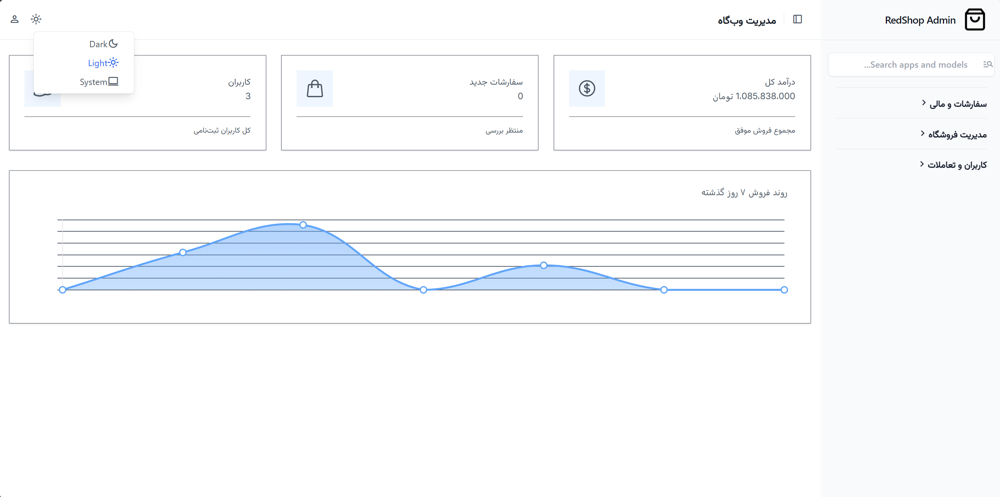
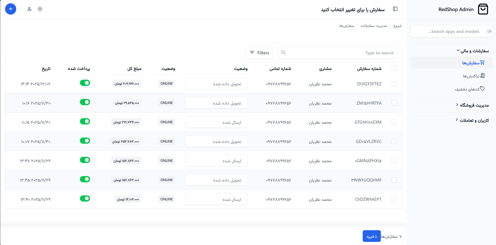
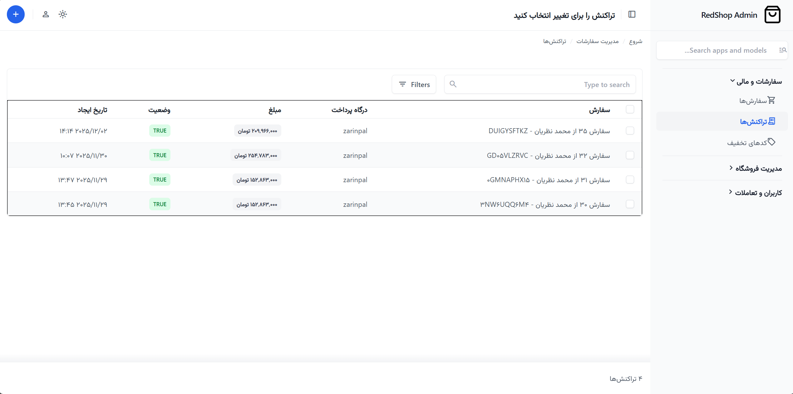
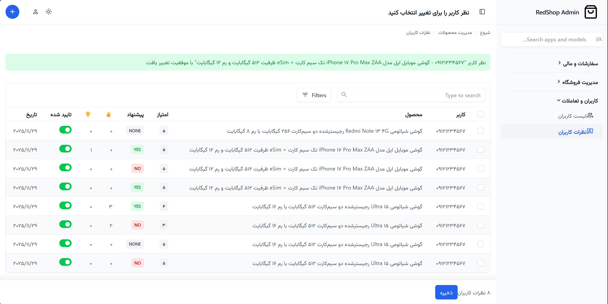
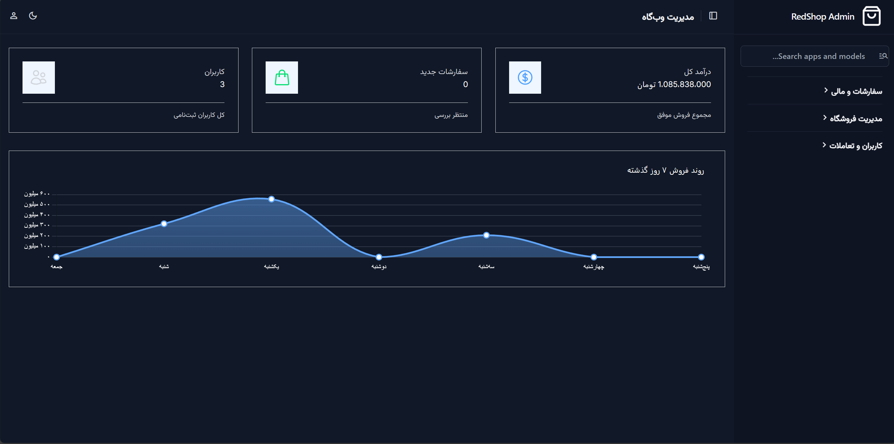

# 🛍️ RedShop - پلتفرم فروشگاه اینترنتی پیشرفته با Django


**RedShop** یک پروژه فروشگاه اینترنتی مدرن، مقیاس‌پذیر و کامل است که با هدف پیاده‌سازی استانداردهای مهندسی نرم‌افزار و تجربه کاربری (UX) سطح بالا توسعه داده شده است. این پروژه فراتر از یک فروشگاه ساده بوده و شامل زیرساخت‌های پیشرفته‌ای مانند داشبورد مدیریتی BI، سیستم مقایسه کالا و پروفایل کاربری SPA-like است.

> 🚧 **نکته:** این پروژه به صورت مداوم در حال توسعه و بهینه‌سازی (Refactoring) است تا به استانداردهای سطح Senior نزدیک‌تر شود.

---

## 👋 درباره پروژه و چالش‌های فنی

به عنوان توسعه‌دهنده این پروژه، تمرکز من بر روی **«کیفیت کد»** و **«معماری تمیز»** بوده است. در این مسیر با چالش‌های فنی متعددی روبرو شدم و آن‌ها را حل کردم:

* **بهینه‌سازی دیتابیس:** حل مشکل N+1 در کوئری‌های تو در تو (مثل منوی دسته‌بندی و سبد خرید) با استفاده از `select_related` و `prefetch_related`.
* **رابط کاربری مدرن:** مهاجرت کامل از CSS سنتی به **Tailwind CSS** برای طراحی ریسپانسیو و تمیز.
* **پنل مدیریت سفارشی:** جایگزینی ادمین پیش‌فرض جنگو با **Django Unfold** و شخصی‌سازی کامل آن برای پشتیبانی از راست‌چین (RTL)، فونت فارسی و دارک مود.
* **معماری ماژولار:** جداسازی منطق‌های مختلف (فروش، کاربران، تخفیف، مقایسه) در اپلیکیشن‌های مستقل.

---

## ✨ ویژگی‌های برجسته (Key Features)

### 🏗️ زیرساخت و بک‌اند (Back-end)
* **معماری تمیز (Clean Architecture):** جداسازی لایه بیزنس (Services) از لایه نمایش (Views).
* **احراز هویت سفارشی:** سیستم لاگین با شماره موبایل (بدون نیاز به Username).
* **دسته‌بندی درختی (Tree Structure):** پیاده‌سازی دسته‌بندی‌های نامحدود و تو در تو با `django-mptt`.
* **ویژگی‌های پویا (EAV):** قابلیت تعریف ویژگی‌های فنی اختصاصی برای هر دسته‌بندی (مثل پردازنده برای لپ‌تاپ و جنس برای لباس).
* **امنیت:** استفاده از CSRF Token در تمام درخواست‌های AJAX و اعتبارسنجی دقیق فرم‌ها.

### 🛒 تجربه خرید و فروش
* **سبد خرید هوشمند:** ذخیره سبد خرید در Session با قابلیت محاسبه آنی قیمت و تخفیف.
* **سیستم تخفیف (Coupon):** موتور اعمال کد تخفیف با محدودیت‌های زمانی و تعدادی.
* **درگاه پرداخت:** اتصال کامل به درگاه پرداخت (زرین‌پال سندباکس) و مدیریت بازگشت تراکنش (Callback).
* **فاکتور رسمی:** تولید خودکار فاکتور PDF استاندارد با پشتیبانی از فونت فارسی (WeasyPrint).
* **نوتیفیکیشن:** ارسال ایمیل خودکار هنگام ثبت سفارش و تغییر وضعیت ارسال.

### 🎨 فرانت‌اند و تعاملات (Front-end)
* **داشبورد کاربری SPA-like:** مدیریت پروفایل، آدرس‌ها، سفارش‌ها و علاقه‌مندی‌ها بدون رفرش صفحه (AJAX).
* **سیستم مقایسه (Compare):** امکان مقایسه ویژگی‌های فنی محصولات هم‌دسته در یک جدول داینامیک.
* **جستجوی زنده (Live Search):** پیشنهاد محصول و دسته‌بندی در لحظه تایپ کاربر.
* **مگا منو (Mega Menu):** منوی دسته‌بندی حرفه‌ای با انیمیشن‌های نرم و تاخیر هوشمند.
* **تعاملات اجتماعی:** لایک و دیس‌لایک نظرات، ثبت نظر با امتیاز ستاره‌ای و پیشنهاد خرید.

### 👮‍♂️ داشبورد مدیریت پیشرفته (Admin Panel)
* **رابط کاربری مدرن:** استفاده از پکیج `django-unfold` با تم Tailwind.
* **داشبورد تحلیلی (BI Dashboard):** نمایش نمودار فروش ۷ روز گذشته و کارت‌های آمار کلیدی (KPI) در صفحه اول.
* **راست‌چین و فارسی:** اصلاح کامل CSS برای نمایش صحیح فونت وزیر و اعداد فارسی در تمام بخش‌ها.
* **دارک مود (Dark Mode):** پشتیبانی کامل و خودکار از حالت شب با کنتراست استاندارد.

---

## 📸 گالری تصاویر (Screenshots)

<div align="center">
  <h3>📱 نمای فروشگاه</h3>
  
  <br><br>
  
  <br><br>
  
  <br><br>
  
  <br><br>
  
  <br><br>
  
  <br><br>
  
  <br><br>
  
  <br><br>
  
  <br><br>
  
  <br><br>
</div>

---

## 🛠️ تکنولوژی‌های استفاده شده

* **Language:** Python 3.13
* **Framework:** Django 5.2
* **Database:** PostgreSQL (Production) / SQLite (Dev)
* **Frontend:** HTML5, Tailwind CSS 3, JavaScript (Vanilla ES6 + jQuery for AJAX)
* **Payment Gateway:** Zarinpal

### 📦 کتابخانه‌های کلیدی (Key Libraries)
* **مدیریت داده‌ها:** `django-mptt`, `django-jalali`, `psycopg2-binary`
* **رابط کاربری ادمین:** `django-unfold`
* **پردازش تصویر و مدیا:** `pillow`, `easy-thumbnails`
* **گزارش‌گیری:** `weasyprint` (PDF Generation)
* **ابزارها:** `requests`, `python-slugify`, `django-resized`

*(برای مشاهده لیست دقیق وابستگی‌ها، فایل `requirements.txt` را بررسی کنید)*

---

## 🚀 نصب و راه‌اندازی (Installation)

برای اجرای این پروژه روی سیستم خودتان، مراحل زیر را طی کنید:

1.  **کلون کردن مخزن:**
    ```bash
    git clone [https://github.com/your-username/RedShop.git](https://github.com/your-username/RedShop.git)
    cd RedShop
    ```

2.  **ساخت محیط مجازی (Virtual Environment):**
    ```bash
    python -m venv venv
    # ویندوز:
    venv\Scripts\activate
    # مک/لینوکس:
    source venv/bin/activate
    ```

3.  **نصب وابستگی‌ها:**
    ```bash
    pip install -r requirements.txt
    ```

    > **نکته:** برای استفاده از قابلیت تولید PDF، ممکن است نیاز به نصب GTK3 داشته باشید (مخصوص ویندوز).

4.  **اعمال مایگریشن‌ها:**
    ```bash
    python manage.py migrate
    ```

5.  **ساخت سوپریوزر (ادمین):**
    ```bash
    python manage.py createsuperuser
    ```

6.  **اجرای سرور:**
    ```bash
    python manage.py runserver
    ```

---

## 🗺️ نقشه راه آینده (Roadmap)

این ویژگی‌ها در حال توسعه هستند یا به زودی اضافه خواهند شد:

- [x] سیستم جستجو و فیلتر پیشرفته (AJAX)
- [x] درگاه پرداخت و صدور فاکتور
- [x] سیستم مقایسه محصولات
- [x] داشبورد مدیریت با نمودار
- [ ] **ورود با پیامک (OTP)** 📲
- [ ] **سیستم تیکت پشتیبانی** 🎫
- [ ] **انبارداری پیشرفته و رزرو کالا** 📦
- [ ] **داکریزه کردن پروژه (Docker)** 🐳

---

## 🤝 ارتباط با من

من مشتاق یادگیری و همکاری هستم! اگر پیشنهادی برای بهبود کدها دارید یا باگی پیدا کردید، خوشحال می‌شوم بشنوم.

* 📧 ایمیل: pythonnazarian@gmail.com

---
⭐️ **اگر این پروژه برایتان مفید بود یا از کدنویسی آن خوشتان آمد، لطفاً به آن ستاره دهید!**